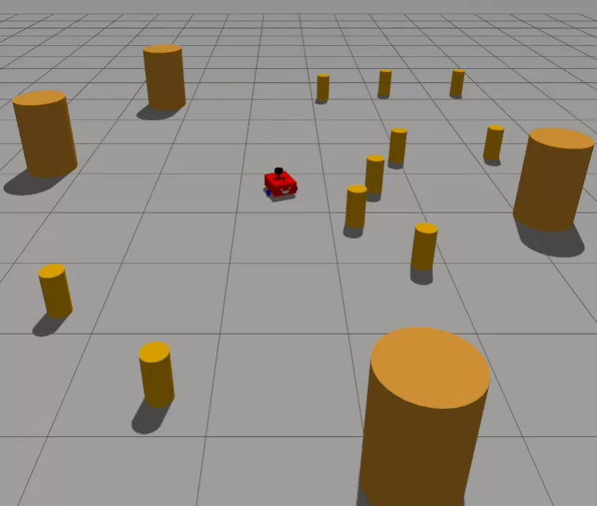

# Autonomous Navigation in ROS2

In this work we built a differential drive robot with online asynchronous SLAM and autonomous navigation with ROS2 and Gazebo. 

**[Project Page](https://ole2412.github.io/autonomous_navigation/)**



## System Architecture

The system is split into three independent launch domains that communicate via ROS2 topics, services, and actions:

1. **Simulation & Bringup** — spawns the robot in Gazebo, runs the differential drive controller, bridges Gazebo sensors to ROS topics, and arbitrates velocity commands.
2. **SLAM** — builds an occupancy grid from LiDAR scans and publishes the map.
3. **Navigation (Nav2)** — plans and executes paths based on the map and goal poses.

## Prerequisites

- **ROS2 Jazzy** (other versions may require adaptations)
- **[slam_toolbox](https://github.com/SteveMacenski/slam_toolbox)**
- **[nav2](https://docs.nav2.org/rolling/getting_started/build_and_install/local_installation/#local-installation)**
- **[colcon](https://colcon.readthedocs.io/en/released/user/installation.html)**

<!-- Install colcon with:
```bash
sudo apt install python3-colcon-common-extensions
``` -->

## Installation

1. Build the workspace:
```bash
colcon build --symlink-install
```

2. Source the setup files:
```bash
source /opt/ros/jazzy/setup.bash
source install/setup.bash
```

<!-- ### Basic Simulation

Launch the Gazebo simulator with an empty world:
```bash
ros2 launch ros_gz_sim gz_sim.launch.py gz_args:="-r empty.sdf"
```

Spawn the robot into Gazebo:
```bash
ros2 run ros_gz_sim create -topic robot_description -name my_bot
```

Load and activate the differential controller:
```bash
ros2 run controller_manager spawner diff_cont
```

Start RViz with the configuration:
```bash
rviz2 -d src/my_bot/config/drive.rviz
``` -->

<!-- ### Teleoperation

**Option 1: RViz GUI Panel**
Use the teleop panel in RViz to control the robot.

**Option 2: Keyboard Control**
```bash
ros2 run teleop_twist_keyboard teleop_twist_keyboard
``` -->

## Quick Start

Launch the simulation with a custom world:
```bash
ros2 launch my_bot launch_sim.launch.py world:=src/my_bot/worlds/obstacles.world
```

Start the online asynchronous SLAM node:
```bash
ros2 launch slam_toolbox online_async_launch.py \
  use_sim_time:=true \
  slam_params_file:=./src/my_bot/config/mapper_params_online_async.yaml
```

Open RViz:
```bash
rviz2 -d src/my_bot/config/drive.rviz
```

In RViz, click **"2D Pose Estimate"** to provide an initial pose estimate for localization.

## Navigation

Start the Nav2 navigation stack:
```bash
ros2 launch nav2_bringup navigation_launch.py use_sim_time:=true
```

You can now set navigation goals in RViz.

### Key Topics & Actions

| Name | Type | Publisher → Subscriber |
|---|---|---|
| `/scan` | `sensor_msgs/LaserScan` | Gazebo GPU LiDAR (via ros_gz_bridge) → SLAM, Nav2 costmaps, RViz |
| `/camera/image_raw`, `/camera/camera_info` | `sensor_msgs/Image`, `CameraInfo` | Gazebo camera (via ros_gz_bridge) → RViz display |
| `/joint_states` | `sensor_msgs/JointState` | Joint state broadcaster → Robot State Publisher |
| `/cmd_vel` | `geometry_msgs/Twist` | RViz teleop panel / keyboard / Nav2 → twist_mux → twist_stamper |
| `/diff_cont/cmd_vel` | `geometry_msgs/TwistStamped` | twist_stamper → differential drive controller |
| `/odom` | `nav_msgs/Odometry` | Differential drive controller → SLAM, Nav2, RViz |
| `/tf`, `/tf_static` | `tf2_msgs/TFMessage` | Diff controller (odom→base_link), RSP (fixed frames), SLAM (map→odom) → all nodes |
| `/map` | `nav_msgs/OccupancyGrid` | SLAM → Nav2, RViz |
| `/map_updates` | `map_msgs/OccupancyGridUpdate` | SLAM → RViz display |
| `/initialpose` | `geometry_msgs/PoseWithCovarianceStamped` | RViz "2D Pose Estimate" → SLAM |
| `/goal_pose` | `geometry_msgs/PoseStamped` | RViz "2D Pose Goal" → Nav2 action server |
| `navigate_to_pose` | `nav2_msgs/NavigateToPose` (action) | RViz goal tool / client → Nav2 bt_navigator |

## Acknowledgments

This project is inspired by the excellent ROS2 robot tutorial series by [Josh Newans](https://github.com/joshnewans). See the [full playlist](https://www.youtube.com/watch?v=OWeLUSzxMsw&list=PLunhqkrRNRhYAffV8JDiFOatQXuU-NnxT&index=1) for more details.